 

 

 

---

### About

Full stack developer with hands-on experience across web, mobile, and desktop projects. Focused on modern architectures, clean code, and solid development practices. Interested in artificial intelligence, data analysis, automation, and information security.

Project management with **Plane** for agile workflows.

---

### Stack

**Frontend**

**Backend & BaaS**

**Languages**

**Databases**

**DevOps & Infra**

---

### GitHub Stats

 

 

---

  

